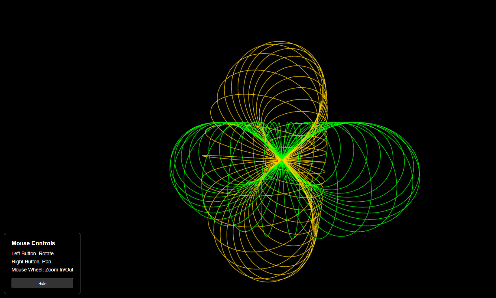

# 3D Torus Animation with Lemniscate Curves

This project demonstrates an interactive 3D animation of lemniscate curves arranged in a torus-like pattern. The animation is created using Three.js and features both horizontal and vertical curve patterns that form a complex 3D structure.

Demo: https://tangerine-rolypoly-87398f.netlify.app/
## Features

- Real-time 3D animation of lemniscate curves
- Interactive camera controls
- Smooth curve generation
- Dynamic color transitions between horizontal and vertical curves
- Information panel with control instructions

## Technologies Used

- Three.js - 3D graphics library
- HTML5 Canvas
- ES6+ JavaScript
- CSS3 with modern features (backdrop-filter, transitions)

## How to Run

1. Clone or download this repository
2. Open `index.html` in a modern web browser
3. No build process or npm installation required!

## Controls

- **Left Mouse Button**: Rotate the view
- **Right Mouse Button**: Pan the camera
- **Mouse Wheel**: Zoom in/out
- **I Key**: Toggle the information panel

## Technical Details

### Animation Components

- **Lemniscate Curves**: Mathematical curves in the shape of a figure-eight
- **Color Scheme**:
  - Horizontal curves: Green (#00ff00)
  - Vertical curves: Yellow (#ffd200)
  - Moving point: Red (#ff0000)

### Implementation Details

The animation is created by:
1. Generating lemniscate curves using parametric equations
2. Rotating these curves around a central axis
3. Creating both horizontal and vertical patterns
4. Rendering everything using WebGL through Three.js

## Browser Compatibility

Works best in modern browsers that support:
- WebGL
- ES6 Modules
- CSS backdrop-filter

## License

This project is open source and available under the MIT License.

## Credits

Created as a demonstration of 3D mathematical visualization using Three.js and modern web technologies.
